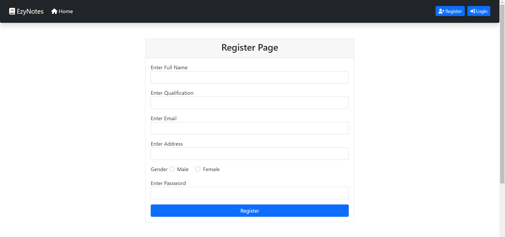
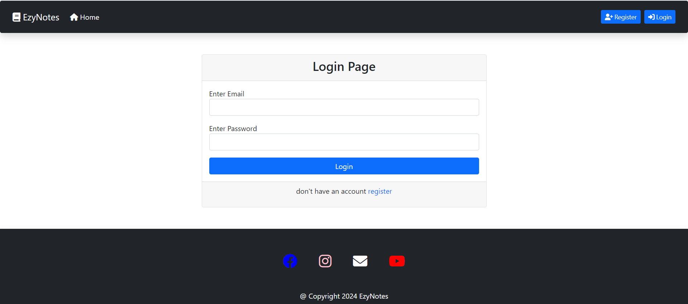
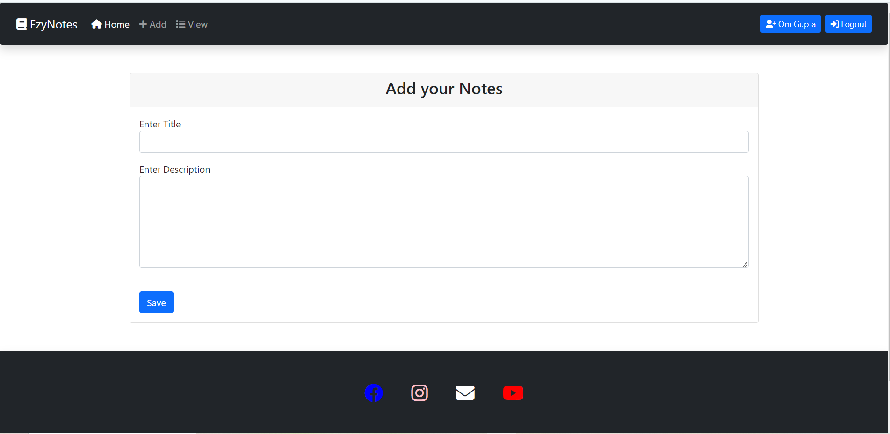
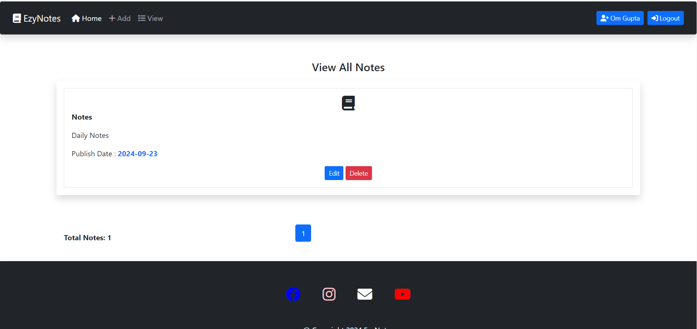
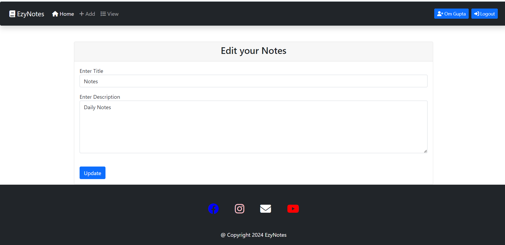

# EzyNotes :rocket: :bulb: :computer:








Ezynote is a web-based note-taking application designed to help users easily create, manage, and organize their notes. Built with Spring Boot, Thymeleaf, and PostgreSQL, Ezynote offers a user-friendly interface for note management, including features such as categorization, tagging, and search functionality.

## Table of Contents

- [Features](#features)
- [Demo](#demo)
- [Diagram](#diagram)
- [Technologies Used](#technologies-used)
- [Installation](#installation)
- [Usage](#usage)
- [Contributing](#contributing)

## Features

- User authentication (registration, login, logout).
- Create, read, update, delete (CRUD) operations for notes.
- Note categorization and tagging.
- Pagination for notes.
- Responsive design for mobile and desktop use.

## Demo

You can try out the BlogSphere live [here](https://ezynotes-wwdl.onrender.com).

## Diagram

```

+-----------------+              +-------------+
|      User       |1           * |    Notes    |
+-----------------+ <----------> +-------------+
| - id: Integer   |              | - id: Integer   |
| - name: String  |              | - title: String |
| - qualification: String|       | - description: String |
| - email: String |              | - date: LocalDate     |
| - address: String|             | - user_id: Integer    |
| - gender: String|              +-------------+
| - password: String|
| - role: String   |
+-----------------+


```

## Technologies Used

- JAVA17
- Spring Boot
- Spring Web
- Spring Data JPA
- Spring Security
- PostgreSQL
- Lombok
- Thymeleaf
- Maven
- -BootStrap

## Installation

To run this project locally, follow these steps:

1. Clone the repository:

    ```bash
    git clone https://github.com/omgupta7352/Ezynotes.git
    ```

2. Navigate to the project directory:

    ```bash
    cd Ezynotes
    ```


3. Build and run the application:

    ```bash
    mvn clean install
    ```

    ```bash
    mvn spring-boot:run
    ```
    

4. Open your web browser and go to `http://localhost:8080`.

## Usage

1. Open your browser and navigate to `http://localhost:8080`
2. Register a new user account.
3. Log in using your credentials.
4. Create, edit, and delete notes.


## Contributing

Contributions are welcome! If you would like to contribute to this project, please follow these steps:

1. Fork the repository.
2. Create a new branch for your feature or bugfix:

    ```bash
    git checkout -b feature/your-feature-name
    ```

3. Commit your changes:

    ```bash
    git commit -m 'Add some feature'
    ```

4. Push to the branch:

    ```bash
    git push origin feature/your-feature-name
    ```

5. Open a pull request on GitHub.
  
